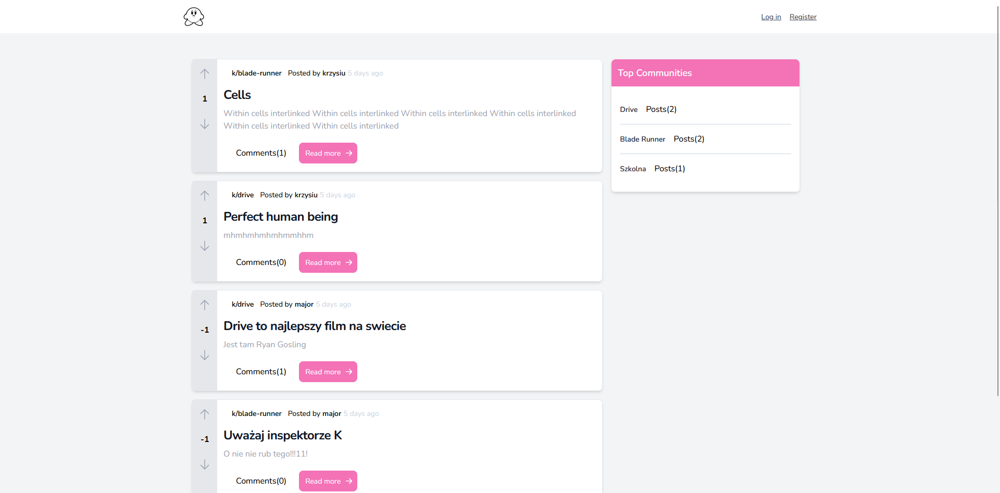
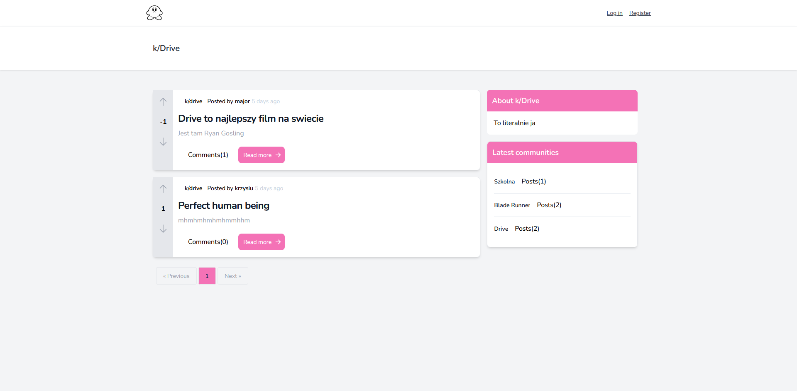
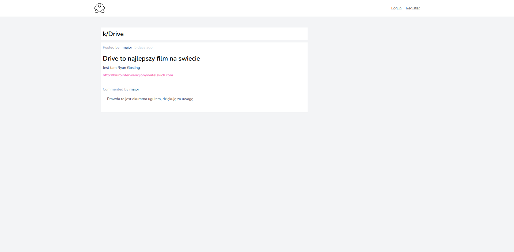
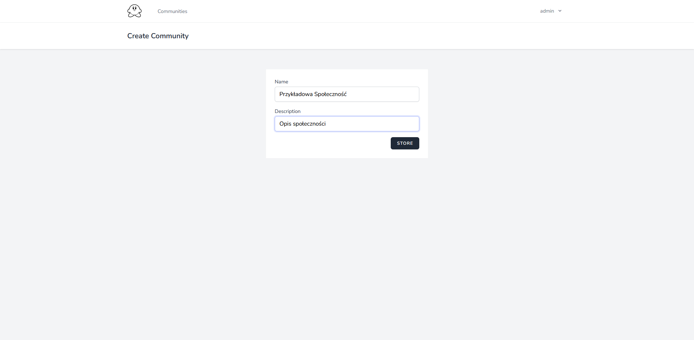
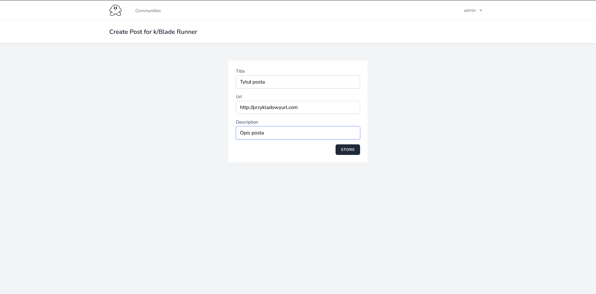

## O kirbicie

Kirbit to klon reddita wykonany w oparciu o:

- [Laravel](https://laravel.com/)
- [Breeze](https://github.com/laravel/breeze)
- [InertiaJS](https://inertiajs.com/)
- [VueJS](https://vuejs.org/)
- [TailwindCSS](https://vuejs.org/)

## Funkcjonalności

- Rejestracja i logowanie użytkowników(Breeze)
- Tworzenie społeczności
- Tworzenie postów dla danej społeczności
- Komentowanie postów
- Oddawanie głosu dla posta
- Usuwanie postów
- Edycja postów
- Usuwanie społeczności
- Edycja społeczności
- Walidacja(Breeze)

## Wygląd strony

### Strona główna

### Społeczność

### Post

### Tworzenie społeczności

### Tworzenie posta

## Co może użykownik?

### User

- Stworzyć społeczność
- Stworzyć post
- Oddać głos dla posta

#### Jeśli do niego należy dany element

- Edytować społeczność
- Usunąć społeczność
- Edytować post
- Usunąć post

### Admin

- Wszystko co User

#### Dodatkowo

- Usunąć każdy post
- Usunąć każde community

## Użyte modele

### Komentarz

- id użytkownika
- id posta
- zawartość komentarza

### Społeczność

- id użytkownika
- nazwa społeczności
- opis
- slug

### Post

- id użytkownika
- id społeczności
- slug
- opis
- url
- głosy

### Głos dla posta

- id użytkownika
- id posta
- dany głos

### Użytkownik

- imię
- nazwa użytkownika
- email
- hasło

## Jak uruchomić projekt?

### Przed pierwszym uruchomieniem

- w bazie danych (najlepiej phpmyadmin xampp) stworzyć bazę `'rered'`
- w Terminalu przejść do ścieżki z projektem
- wykonać `npm install`
- wykonać `npm run dev`
- wyłączyć run dev używająć `'Ctrl+C'`
- wykonać migrację bazy `php artisan migrate`

### Uruchamianie

- uruchomić dwie instancje terminala
- w jednej wykonać `npm run dev`
- w drugiej `php artisan serve`
- w przeglądarce wejść na url `localhost:8000`